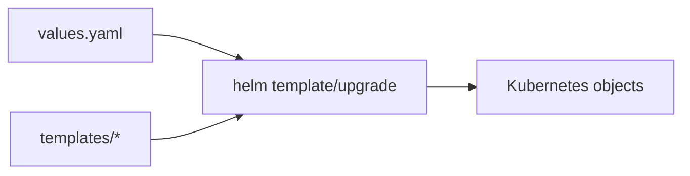

# Helm Chart Demo

**Stack skills:** `Kubernetes · Helm · Git`

> Full portfolio stack: Linux · Docker · Kubernetes · Jenkins · GitLab CI · Ansible · Terraform · Prometheus · Grafana · Zabbix · Nginx · Git · Python · Bash · PowerShell
>
> Hub: https://github.com/qwertqaze102-prog/devops-portfolio-hub


## Flow



Simple Helm chart packaging for a web app:
- values.yaml
- deployment/service templates
- helpers / labels

```bash
helm lint ./charts/demo-web
helm template demo ./charts/demo-web
helm upgrade --install demo ./charts/demo-web -n demo --create-namespace
```

## Screenshots / how it looks

> Diagrams above show architecture. Run the stack locally and attach UI screenshots here if needed:
> - `docs/screenshots/` folder (optional)
> - keep secrets out of screenshots
